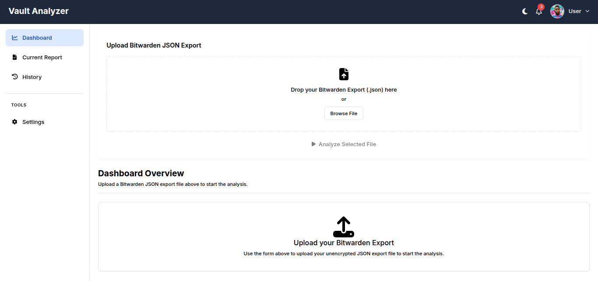
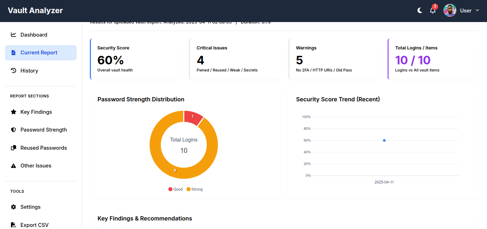
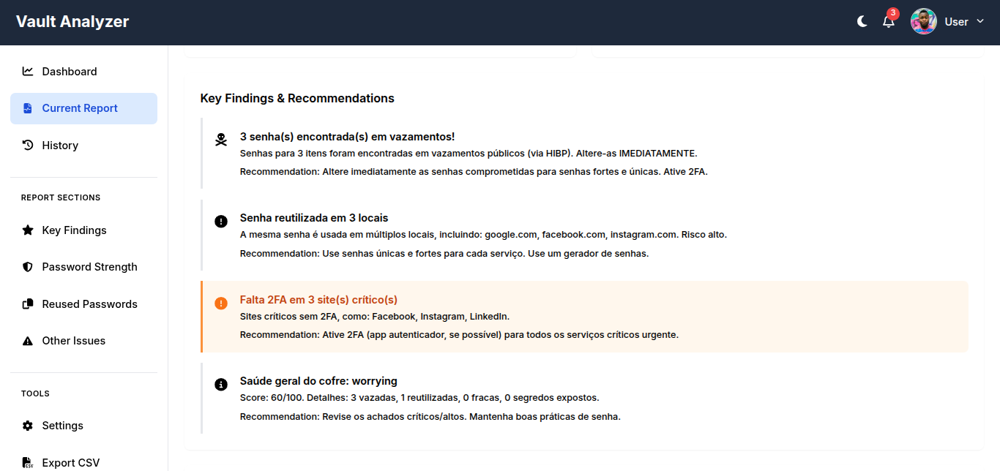
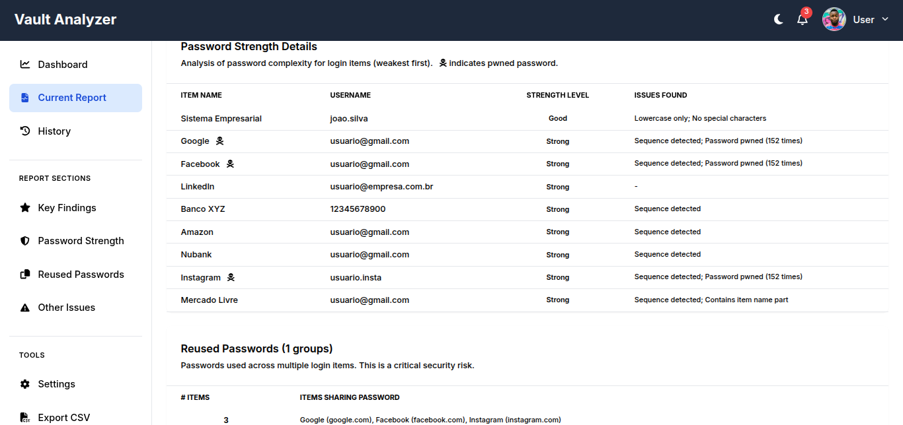
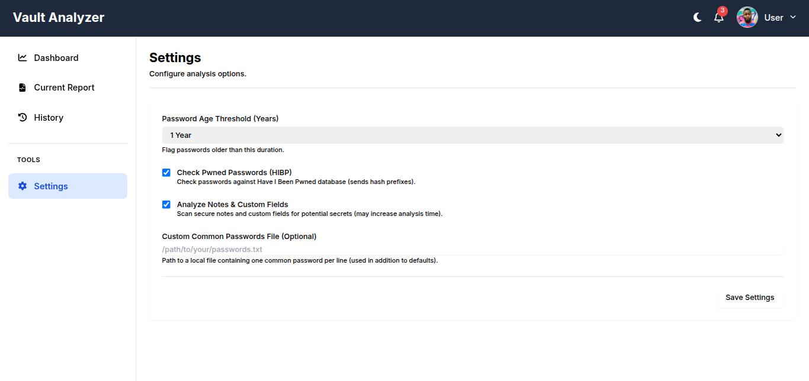
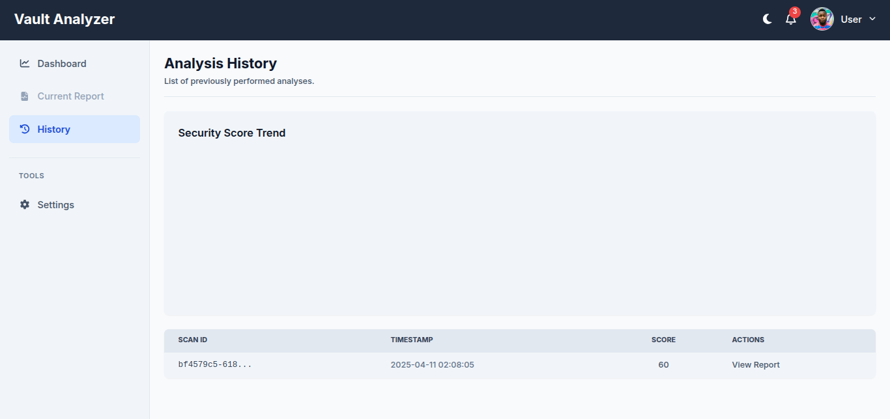
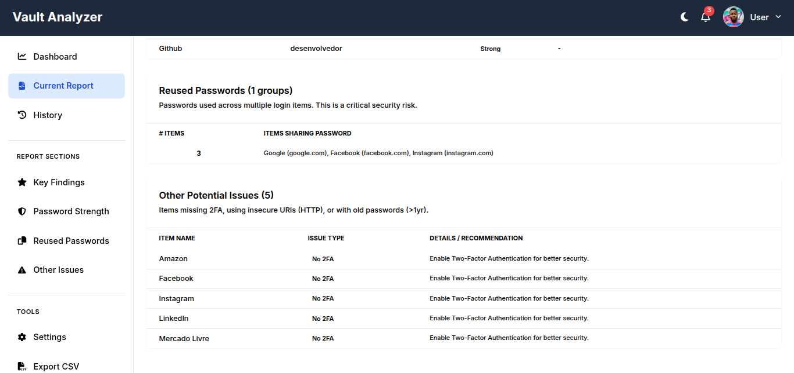

# Bitwarden Vault Analyser 🔐


[](https://www.python.org/)
[](https://flask.palletsprojects.com/)
[](LICENSE)
[](https://github.com/bernardopg/bitwarden_vault_analyser)

[Português](#-português) • [English](#-english)



---

## 🇧🇷 Português

> Uma aplicação web Flask para analisar exportações do cofre Bitwarden (formato JSON não criptografado) e fornecer insights de segurança.

### 📋 Índice

- [📊 Recursos](#-recursos)
- [📸 Demonstração](#-demonstração)
- [🛠️ Configuração e Instalação](#️-configuração-e-instalação)
- [🚀 Executando a Aplicação](#-executando-a-aplicação)
- [📤 Exportando do Bitwarden](#-exportando-do-bitwarden)
- [🔒 Considerações de Segurança](#-considerações-de-segurança)
- [🔮 Trabalhos Futuros](#-trabalhos-futuros)
- [👥 Contribuindo](#-contribuindo)
- [📄 Licença](#-licença)

### 📊 Recursos

**Coluna 1:**

- **📤 Upload e Análise:** Faça upload da sua exportação JSON não criptografada do Bitwarden.
- **🏆 Pontuação de Segurança:** Obtenha uma pontuação geral de segurança para seu cofre baseada em várias métricas.
- **💪 Análise de Força de Senha:** Classifica cada senha de login como Muito Fraca, Fraca, Razoável, Boa ou Forte.
- **🔄 Detecção de Senhas Reutilizadas:** Identifica senhas usadas em múltiplos itens de login (Risco Crítico).
- **🔍 Verificação de Senhas Vazadas:** Verifica senhas contra o banco de dados Have I Been Pwned (HIBP) usando k-Anonimato (Opcional, habilitado por padrão).

**Coluna 2:**

- **🔓 Verificação de URI Insegura:** Sinaliza logins usando URIs `http://` simples.
- **⏰ Detecção de Senhas Antigas:** Identifica senhas não atualizadas recentemente (padrão > 1 ano, configurável).
- **🕵️ Escaneamento de Segredos:** Escaneia Notas Seguras e Campos Personalizados para potenciais segredos expostos.
- **📊 Principais Descobertas e Recomendações:** Destaca os problemas mais críticos encontrados.
- **📝 Relatórios Detalhados:** Fornece tabelas detalhando força de senha, reutilização e outros problemas.

**Coluna 3:**

- **📜 Visualização de Histórico:** Navegue por relatórios de análise anteriores e veja tendências de pontuação ao longo do tempo.
- **📁 Exportação CSV:** Exporte os dados completos do relatório de análise para um arquivo CSV.
- **⚙️ Análise Configurável:** Ajuste configurações como limite de idade de senha e alternância de recursos.
- **🌓 Modo Escuro:** Alterne entre temas claro e escuro para melhor visualização.

### 📸 Demonstração

#### Galeria de Screenshots

#### Dashboard com Resumo da Análise


#### Análise de Força de Senha



#### Detecção de Senhas Reutilizadas



#### Verificação de Senhas Vazadas



#### Página de Configurações



#### Histórico de Análises



#### Relatório Detalhado



### 🛠️ Configuração e Instalação

**Pré-requisitos:**

- Python 3.8+
- `pip` (instalador de pacotes Python)
- Git (opcional, para clonar)

**Instalação Rápida:**

```bash
# Clone o repositório (ou baixe o código-fonte)
git clone https://github.com/bernardopg/bitwarden_vault_analyser
cd bitwarden_vault_analyser

# Crie e ative um ambiente virtual
python3 -m venv venv
source venv/bin/activate

# Instale as dependências
pip install -r requirements.txt

# Configure as definições iniciais
cp settings_template.json settings.json
```

### 🚀 Executando a Aplicação

1. **Inicie o Servidor de Desenvolvimento:**

   ```bash
   flask run
   ```

2. **Acesso:** Abra seu navegador web e navegue até `http://127.0.0.1:5000`

3. **Uso:**
   - Faça upload do arquivo JSON do Bitwarden usando o formulário no painel
   - Aguarde a conclusão da análise (verificações HIBP podem levar tempo)
   - Visualize o relatório gerado com insights de segurança detalhados
   - Navegue para Histórico ou Configurações através da barra lateral

### 📤 Exportando do Bitwarden

**Procedimento:**

1. Abra seu Cofre Web Bitwarden, Aplicativo Desktop ou Extensão do Navegador
2. Vá para **Ferramentas** > **Exportar Cofre**
3. Selecione **`.json`** como o formato do arquivo
4. **CRÍTICO:** Certifique-se de selecionar **JSON não criptografado**
5. Digite sua senha mestra para confirmar
6. Salve o arquivo `.json` exportado com segurança

> ⚠️ **AVISO DE SEGURANÇA**
> O arquivo de exportação contém suas senhas em texto simples. Manuseie-o com extremo cuidado e exclua-o após a análise, se desejar. Recomendamos executar esta ferramenta apenas em ambientes confiáveis.

### 🔒 Considerações de Segurança

**IMPORTANTE:** A análise requer uma exportação **não criptografada** do Bitwarden. Este arquivo é altamente sensível. Execute esta ferramenta em uma máquina confiável, manuseie o arquivo de exportação com extremo cuidado e exclua-o com segurança após o uso.

- **Verificação HIBP:** A verificação de Senhas Vazadas envia os primeiros 5 caracteres do hash SHA-1 de suas senhas para a API HIBP (k-Anonimato). Ela _não_ envia suas senhas em texto simples pela rede. Você pode desabilitar esta verificação nas Configurações se tiver preocupações.

- **Implantação em Produção:** O servidor Flask integrado **NÃO** é adequado para produção. Use um servidor WSGI de nível de produção (ex., Gunicorn, Waitress) atrás de um proxy reverso (ex., Nginx). Defina `DEBUG = False` em `app.py` ou via variáveis de ambiente.

- **Recomendações adicionais:**
  - Use HTTPS em ambientes de produção
  - Defina uma chave secreta personalizada
  - Considere adicionar limitação de taxa e proteção CSRF

### 🔮 Trabalhos Futuros

#### Ver planos futuros

- **Processamento Assíncrono Completo:** Implementar filas de tarefas (Celery/RQ) para análises de longa duração para melhorar a responsividade da UI.
- **Armazenamento em Banco de Dados:** Armazenar resultados e configurações em um banco de dados em vez de arquivos JSON para melhor escalabilidade e consulta (especialmente para análise de tendências).
- **Contas de Usuário:** Implementar contas de usuário para gerenciar múltiplos cofres e histórico com segurança.
- **Recursos Avançados de Tabela:** Adicionar pesquisa, ordenação e paginação do lado do cliente ou do servidor para tabelas grandes.
- **Exportação PDF:** Implementar geração de relatório PDF usando WeasyPrint ou similar.
- **Mais Tipos de Análise:**
  - Verificar perguntas de segurança fracas (se incluídas na exportação).
  - Analisar histórico de senhas (campo `passwordHistory`).
  - Verificar itens sem URIs.
- **UI/UX Aprimorada:** Design visual mais refinado, melhores indicadores de progresso, destaque avançado na barra lateral.
- **Testes Unitários e de Integração:** Expandir significativamente a cobertura de testes.

### 👥 Contribuindo

Contribuições são bem-vindas! Sinta-se à vontade para abrir issues ou enviar pull requests para melhorar este projeto.

**Processo:**

1. Faça um fork do projeto
2. Crie sua branch de feature
   `git checkout -b feature/RecursoIncrivel`
3. Commit suas mudanças
   `git commit -m 'Adiciona algum recurso incrível'`
4. Push para a branch
   `git push origin feature/RecursoIncrivel`
5. Abra um Pull Request

### 📄 Licença

Este projeto está licenciado sob a Licença MIT - veja a seção [License](#-license) para detalhes.

---

## 🇬🇧 English

> A Flask web application to analyze Bitwarden vault exports (unencrypted JSON format) for security insights.

### 📋 Table of Contents

- [📊 Features](#-features)
- [📸 Demo](#-demo)
- [🛠️ Setup & Installation](#️-setup--installation)
- [🚀 Running the Application](#-running-the-application)
- [📤 Exporting from Bitwarden](#-exporting-from-bitwarden)
- [🔒 Security Considerations](#-security-considerations)
- [🔮 Future Work](#-future-work)
- [👥 Contributing](#-contributing)
- [📄 License](#-license)

### 📊 Features

**Column 1:**

- **📤 Upload & Analyze:** Upload your unencrypted Bitwarden JSON export.
- **🏆 Security Score:** Get an overall security score for your vault based on various metrics.
- **💪 Password Strength Analysis:** Classifies each login password as Very Weak, Weak, Fair, Good, or Strong.
- **🔄 Reused Password Detection:** Identifies passwords used across multiple login items (Critical Risk).
- **🔍 Pwned Password Check:** Checks passwords against the Have I Been Pwned (HIBP) database using k-Anonymity (Optional, enabled by default).

**Column 2:**

- **🔓 Insecure URI Check:** Flags logins using plain `http://` URIs.
- **⏰ Old Password Detection:** Identifies passwords not updated recently (default > 1 year, configurable).
- **🕵️ Secret Scanning:** Scans Secure Notes and Custom Fields for potential exposed secrets.
- **📊 Key Findings & Recommendations:** Highlights the most critical issues found.
- **📝 Detailed Reports:** Provides tables detailing password strength, reuse, and other issues.

**Column 3:**

- **📜 History View:** Browse previous analysis reports and view score trends over time.
- **📁 CSV Export:** Export the full analysis report data to a CSV file.
- **⚙️ Configurable Analysis:** Adjust settings like password age threshold and feature toggles.
- **🌓 Dark Mode:** Switch between light and dark themes for better viewing.

### 📸 Demo

#### Screenshot Gallery

#### Dashboard with Analysis Summary


#### Password Strength Analysis


#### Reused Passwords Detection


#### Pwned Passwords Check


#### Settings Page


#### Analysis History


#### Detailed Report


### 🛠️ Setup & Installation

**Prerequisites:**

- Python 3.8+
- `pip` (Python package installer)
- Git (optional, for cloning)

**Quick Install:**

```bash
# Clone the repository (or download source code)
git clone https://github.com/bernardopg/bitwarden_vault_analyser
cd bitwarden_vault_analyser

# Create & activate virtual environment
python3 -m venv venv
source venv/bin/activate

# Install dependencies
pip install -r requirements.txt

# Set up initial settings
cp settings_template.json settings.json
```

### 🚀 Running the Application

1. **Start the Development Server:**

   ```bash
   flask run
   ```

2. **Access:** Open your web browser and navigate to `http://127.0.0.1:5000`

3. **Usage:**
   - Upload the Bitwarden JSON file using the form on the dashboard
   - Wait for the analysis to complete (HIBP checks can take time)
   - View the generated report with detailed security insights
   - Navigate to History or Settings via the sidebar

### 📤 Exporting from Bitwarden

**Procedure:**

1. Open your Bitwarden Web Vault, Desktop App, or Browser Extension
2. Go to **Tools** > **Export Vault**
3. Select **`.json`** as the file format
4. **CRITICAL:** Ensure you select **unencrypted JSON**
5. Enter your master password to confirm
6. Save the exported `.json` file securely

> ⚠️ **SECURITY WARNING**
> The export file contains your passwords in plain text. Handle it with extreme care and delete it after analysis if desired. We recommend running this tool only in trusted environments.

### 🔒 Security Considerations

**IMPORTANT:** The analysis requires an **unencrypted** Bitwarden export. This file is highly sensitive. Run this tool on a trusted machine, handle the export file with extreme care, and delete it securely after use.

- **HIBP Check:** The Pwned Passwords check sends the first 5 characters of the SHA-1 hash of your passwords to the HIBP API (k-Anonymity). It does _not_ send your plain text passwords over the network. You can disable this check in the Settings if you have concerns.

- **Production Deployment:** The built-in Flask server is **NOT** suitable for production. Use a production-grade WSGI server (e.g., Gunicorn, Waitress) behind a reverse proxy (e.g., Nginx). Set `DEBUG = False` in `app.py` or via environment variables.

- **Additional recommendations:**
  - Use HTTPS in production environments
  - Set a custom secret key
  - Consider adding rate limiting and CSRF protection

### 🔮 Future Work

#### View future plans

- **Full Async Processing:** Implement task queues (Celery/RQ) for long-running analyses to improve UI responsiveness.
- **Database Storage:** Store results and settings in a database instead of JSON files for better scalability and querying (especially for trend analysis).
- **User Accounts:** Implement user accounts for managing multiple vaults and history securely.
- **Advanced Table Features:** Add client-side or server-side searching, sorting, and pagination to large tables.
- **PDF Export:** Implement PDF report generation using WeasyPrint or similar.
- **More Analysis Types:**
  - Check for weak security questions (if included in export).
  - Analyze password history (`passwordHistory` field).
  - Check for items without URIs.
- **Improved UI/UX:** More refined visual design, better progress indicators, advanced sidebar highlighting.
- **Unit & Integration Tests:** Expand test coverage significantly.

### 👥 Contributing

Contributions are welcome! Feel free to open issues or submit pull requests to improve this project.

**Process:**

1. Fork the project
2. Create your feature branch
   `git checkout -b feature/AmazingFeature`
3. Commit your changes
   `git commit -m 'Add some AmazingFeature'`
4. Push to the branch
   `git push origin feature/AmazingFeature`
5. Open a Pull Request

### 📄 License

This project is licensed under the MIT License - see below for details.

#### View License

```text
MIT License

Copyright (c) 2025

Permission is hereby granted, free of charge, to any person obtaining a copy
of this software and associated documentation files (the "Software"), to deal
in the Software without restriction, including without limitation the rights
to use, copy, modify, merge, publish, distribute, sublicense, and/or sell
copies of the Software, and to permit persons to whom the Software is
furnished to do so, subject to the following conditions:

The above copyright notice and this permission notice shall be included in all
copies or substantial portions of the Software.

THE SOFTWARE IS PROVIDED "AS IS", WITHOUT WARRANTY OF ANY KIND, EXPRESS OR
IMPLIED, INCLUDING BUT NOT LIMITED TO THE WARRANTIES OF MERCHANTABILITY,
FITNESS FOR A PARTICULAR PURPOSE AND NONINFRINGEMENT. IN NO EVENT SHALL THE
AUTHORS OR COPYRIGHT HOLDERS BE LIABLE FOR ANY CLAIM, DAMAGES OR OTHER
LIABILITY, WHETHER IN AN ACTION OF CONTRACT, TORT OR OTHERWISE, ARISING FROM,
OUT OF OR IN CONNECTION WITH THE SOFTWARE OR THE USE OR OTHER DEALINGS IN THE
SOFTWARE.
```
